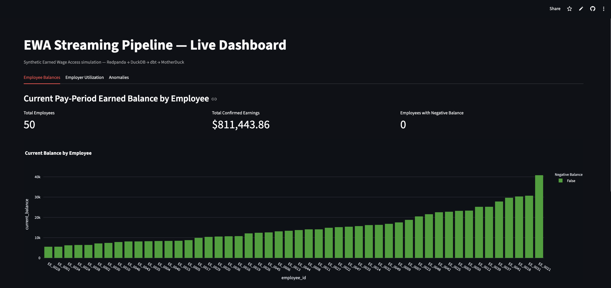
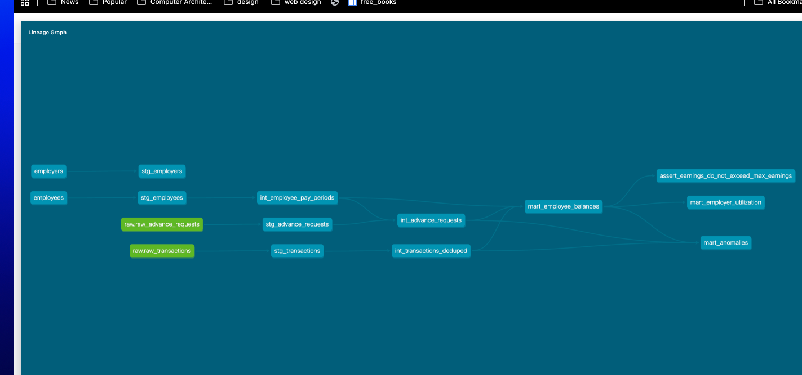

# EWA Streaming Simulation

A real-time Earned Wage Access (EWA) pipeline simulation — synthetic payroll transactions flow through a Kafka-compatible stream, land in DuckDB, get transformed and tested with dbt, sync to a cloud warehouse, and power a live dashboard. Built to demonstrate streaming concepts, dbt depth, and the kind of judgment calls that come up when a plan meets real data.

**[→ Try the live dashboard](https://ewa-streaming-sim-nka3he2ekcqvdph4fv6p6r.streamlit.app/)**

[](https://ewa-streaming-sim-nka3he2ekcqvdph4fv6p6r.streamlit.app/)



---

## Architecture

```
Producer (Python/Faker)
      │
      ▼
Redpanda (Kafka-compatible broker)
      │
      ▼
Consumer ──► DuckDB (raw_transactions, raw_advance_requests)
                    │
                    ▼
              dbt (staging → intermediate → marts)
                    │
                    ▼
              MotherDuck (cloud sync of mart tables)
                    │
                    ▼
              Streamlit (live dashboard)

Orchestration: Dagster — schedules drain → dbt run → dbt test → MotherDuck sync
               as one sequential job, every minute.
```

## Tech Stack

| Layer | Tool |
|---|---|
| Database | DuckDB (embedded, local) |
| Transforms | dbt Core (dbt-duckdb) |
| Streaming | Redpanda (Kafka-compatible, Docker) |
| Ingestion | Python + Faker (producer/consumer) |
| Cloud warehouse | MotherDuck (free tier) |
| Dashboard | Streamlit (deployed on Streamlit Community Cloud) |
| Orchestration | Dagster (local, scheduled) |

Total cost: **$0.**

## What It Demonstrates

- **Streaming concepts**: at-least-once delivery (~10% intentional duplicate transactions), late-arriving events, watermarking
- **dbt depth**: incremental models, a full staging → intermediate → marts layering, 70+ tests including custom business-logic assertions, source freshness, exposures
- **Data quality thinking**: a unified anomaly-detection mart surfacing six distinct anomaly types, backed by real bugs found and fixed during the build (see below)
- **Orchestration**: a proper Dagster job replacing an initial bash-loop scheduler, after discovering DuckDB's single-writer model made naive concurrent scheduling unsafe

## Live Dashboard

The dashboard (synced from MotherDuck, refreshed every minute by the Dagster schedule) has three views:

- **Employee Balances** — current pay-period earned balance per employee (confirmed earnings minus approved advances)
- **Employer Utilization** — advance utilization rate by employer
- **Anomalies** — a live feed of flagged issues: duplicate transactions, late-arriving events, high-value transactions, over-cap advance requests, unmatched pay periods, and employees whose earnings exceed their period cap

## dbt Lineage

Full pipeline lineage from raw sources through staging, intermediate, and mart layers, generated with `dbt docs generate`:



## Engineering Decisions Worth Knowing About

A few real problems came up during the build that shaped the final architecture — the kind of thing that's more interesting to talk through than a clean happy-path plan would be:

- **DuckDB is single-writer.** A long-running consumer process holding a write connection caused every scheduled dbt run to fail with a lock error. Initially patched with short-lived per-message connections and retry-with-backoff; ultimately fixed properly by moving the consumer into a bounded Dagster op that runs to completion and releases its connection before dbt starts — sequential by construction, not by retry.
- **A passing test isn't proof of correctness.** An early version of the earnings-cap test passed trivially because a pay-period join bug was silently producing $0 confirmed earnings for everyone (0 ≤ any cap is always true). Fixing the underlying join made the test meaningful — and it then correctly caught a *different*, legitimate issue: the synthetic transaction generator has no cap on cumulative earnings per period, so most employees genuinely exceed their cap by accumulation. That test is now `severity='warn'`, and the finding is also surfaced as a first-class anomaly type, mirroring how a real EWA platform would monitor (not silently reject) this after the fact.
- **Staging vs. intermediate, and where dedup belongs.** The original plan called for a uniqueness test on `transaction_id` in staging, but `merge`-strategy incremental models only de-duplicate across separate runs, not within one batch — so staging legitimately contains duplicates by design. Uniqueness guarantees live in the intermediate layer instead, where the actual dedup logic executes.

## Running It Locally

```bash
# 1. Environment
python3 -m venv .venv && source .venv/bin/activate
pip install -r requirements.txt

# 2. Start Redpanda
docker compose up -d

# 3. Start the consumer, then the producer (separate terminals)
python3 consumer/consumer.py
python3 generator/producer.py

# 4. Seed and build dbt
cd dbt_project
dbt deps
dbt seed
dbt run
dbt test

# 5. Orchestration (optional — replaces manual dbt runs)
cd ../dagster_project
dagster dev -m ewa_dagster
# then toggle the schedule on at localhost:3000

# 6. Dashboard (local)
streamlit run dashboard/streamlit_app.py

# 7. dbt docs (lineage graph)
cd ../dbt_project
dbt docs generate
dbt docs serve
```

## Project Structure

```
ewa-streaming-sim/
├── generator/            # Kafka producer + advance request batch generator
├── consumer/             # Kafka consumer → DuckDB writer
├── dbt_project/
│   ├── models/
│   │   ├── staging/      # Light typing/renaming, incremental transactions
│   │   ├── intermediate/ # Dedup, pay-period calendar, advance validation
│   │   └── marts/        # Employee balances, employer utilization, anomalies
│   ├── seeds/            # Synthetic employee/employer rosters
│   └── tests/            # Custom business-logic tests
├── dagster_project/      # Orchestration: drain → dbt run → dbt test → sync
├── dashboard/            # Streamlit app + MotherDuck sync script
├── docs/images/          # README screenshots (dashboard, dbt lineage graph)
└── docker-compose.yml    # Redpanda
```